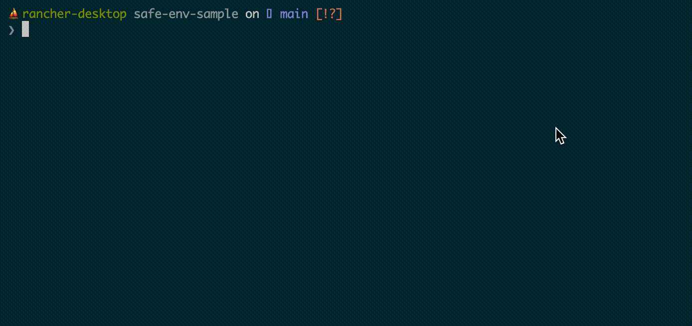
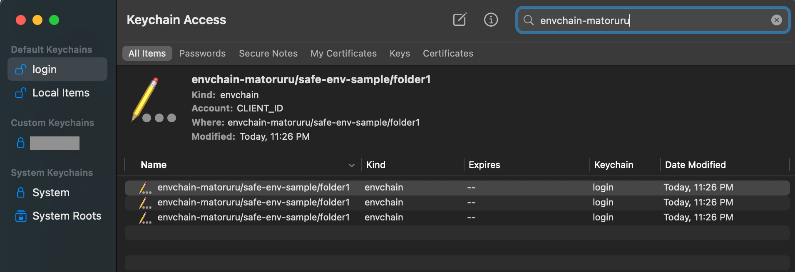

<h1 align="center">🔒 Safe env Tutorial 🔒</h1>

This repository explains how to manage environment variables in local development in a secure way with sample folders([folder1](/folder1), [folder2](/folder2)) through an easy step-by-step tutorial.



## Requirements
To try this repository's sample you need these two commands:

- [direnv](https://direnv.net/docs/installation.html)

   This tool allows us to load/unload environment variables depending on folders. Here's the description from the official page:

   > An extension for your shell. It augments existing shells with a new feature that can load and unload environment variables depending on the current directory.

   Install methods:

   ### macOS
   ```
   brew install direnv
   ```

   ### Ubuntu
   ```
   sudo apt install direnv
   ```

   After installation, you need to add hook for your shell by adding a line in its config file:

   ### BASH
   ```
   # ~/.bashrc
   eval "$(direnv hook bash)"
   ```

   ### ZSH
   ```
   # ~/.zshrc
   eval "$(direnv hook zsh)"
   ```

   ### FISH
   ```
   # ~/.config/fish/config.fish
   direnv hook fish | source
   ```

- [envchain](https://github.com/sorah/envchain#installation)

   This tool allows us to store and dump from a secure place such as macOS's **Keychain Access**. Here's the description from the officiel page.

   > allows you to secure credential environment variables to your secure vault, and set to environment variables only when you called explicitly.

   Install methods:

   ### macOS
   ```
   brew install envchain
   ```

   ### Ubuntu (from source):
   ```
   make
   sudo make install
   cp ./envchaing ~/bin
   ```

## What each folders describe?
Once you installed 2 requirements, you are ready to see how it switches environment variables depending on the current folder by moving between `folder1` and `folder2`. Let's proceed to the tutorial below:

## Tutorial 💪

### Store environment variables securely

1. Run this command to set environment variables for `folder1`.

   ```
   > envchain --set matoruru/safe-env-sample/folder1 CLIENT_ID CLIENT_SECRET URL
   matoruru/safe-env-sample/folder1.CLIENT_ID: 6779ef20e75817b79602
   matoruru/safe-env-sample/folder1.CLIENT_SECRET: YzNyc3BkNzZmZGNtczNiMjhtdGc6UjctX1ZOVEZQaU9
   matoruru/safe-env-sample/folder1.URL: https://example.com/folder1
   ```

1. Open **Keychain Access** and search "envchain-matoruru/safe-env-sample".

   

   The 3 environment variables are stored securely 🎉

1. Run this command to set environment variables for `folder2`.

   ```
   > envchain --set matoruru/safe-env-sample/folder2 CLIENT_ID CLIENT_SECRET URL
   matoruru/safe-env-sample/folder2.CLIENT_ID: 8349ef30e75617c79301
   matoruru/safe-env-sample/folder2.CLIENT_SECRET: WWxCbHFBVjdpUXhFLXVTQzBfWjFqW
   matoruru/safe-env-sample/folder2.URL: https://example.com/folder2
   ```

We saved the 2 set of environment variables securely.

### Switch environment variables per directories

1. Go `folder1`.

   ```
   cd folder1
   ```

   If you got an error like this:

   > direnv: error <Some_Path>/safe-env-sample/folder1/.envrc is blocked. Run `direnv allow` to approve its content

   Just run `direnv allow` as the message suggests. And now it loaded the environment variables for `folder1`.

   Let's check how it is now with `./run.sh`. You should see the values that you stored.

   ```
   > ./run.sh
   CLIENT_ID: 6779ef20e75817b79602
   CLIENT_SECRET: YzNyc3BkNzZmZGNtczNiMjhtdGc6UjctX1ZOVEZQaU9
   URL: https://example.com/folder1
   ```

1. Go `folder2`.

   ```
   cd ../folder2
   ```

   Run `direnv allow` as we did just before. And run `./run.sh`.

   ```
   > ./run.sh
   CLIENT_ID: 8349ef30e75617c79301
   CLIENT_SECRET: WWxCbHFBVjdpUXhFLXVTQzBfWjFqW
   URL: https://example.com/folder2
   ```

1. Go back to `folder1` again.

   Run `./run.sh`.

   ```
   > ./run.sh
   CLIENT_ID: 6779ef20e75817b79602
   CLIENT_SECRET: YzNyc3BkNzZmZGNtczNiMjhtdGc6UjctX1ZOVEZQaU9
   URL: https://example.com/folder1
   ```

   You should see it's switching the values per directories 🎉
